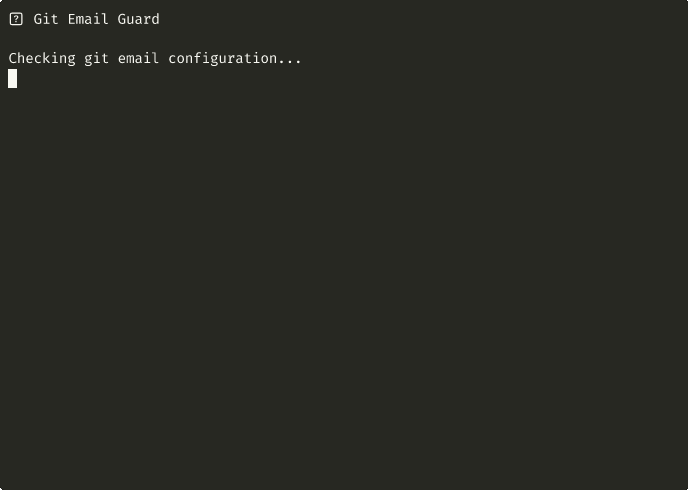

# Git Email Guard

[](https://github.com/ybouhjira/git-email-guard/actions/workflows/ci.yml)



```
 ██████╗ ██╗████████╗    ███████╗███╗   ███╗ █████╗ ██╗██╗
██╔════╝ ██║╚══██╔══╝    ██╔════╝████╗ ████║██╔══██╗██║██║
██║  ███╗██║   ██║       █████╗  ██╔████╔██║███████║██║██║
██║   ██║██║   ██║       ██╔══╝  ██║╚██╔╝██║██╔══██║██║██║
╚██████╔╝██║   ██║       ███████╗██║ ╚═╝ ██║██║  ██║██║███████╗
 ╚═════╝ ╚═╝   ╚═╝       ╚══════╝╚═╝     ╚═╝╚═╝  ╚═╝╚═╝╚══════╝
  ██████╗ ██╗   ██╗ █████╗ ██████╗ ██████╗
 ██╔════╝ ██║   ██║██╔══██╗██╔══██╗██╔══██╗
 ██║  ███╗██║   ██║███████║██████╔╝██║  ██║
 ██║   ██║██║   ██║██╔══██║██╔══██╗██║  ██║
 ╚██████╔╝╚██████╔╝██║  ██║██║  ██║██████╔╝
  ╚═════╝  ╚═════╝ ╚═╝  ╚═╝╚═╝  ╚═╝╚═════╝
```

**A Claude Code hook that prevents you from committing with the wrong email address.**

## The Problem

Ever committed to your work repo with your personal email? Or vice versa?

```bash
# Work repo but personal email... oops!
$ git commit -m "Add customer data handler"
[main abc1234] Add customer data handler
 Author: You <personal@gmail.com>  # 😱 This should be work@company.com!
```

This happens when you:
- Switch between work and personal projects
- Clone a repo and forget to set `user.email`
- Work with multiple GitHub/GitLab/Bitbucket accounts
- Contribute to open source with a different email

## The Solution

**Git Email Guard** is a Claude Code PreToolUse hook that:
- ✅ Warns you BEFORE committing if your email doesn't match the repo
- ✅ Shows commit context (who you're committing as, to which repo)
- ✅ Configurable rules based on remote URL patterns
- ✅ Zero friction - runs automatically in Claude Code

## How It Works

1. Claude Code is about to run `git commit` or `git push`
2. Git Email Guard hook runs first (PreToolUse)
3. Checks your `git config user.email` against rules in config file
4. If mismatch detected → warns you with correct email
5. If match → shows commit context
6. You decide: fix email or proceed

## Installation

### Prerequisites
- [Claude Code](https://claude.ai/code) installed
- `jq` installed (`brew install jq` on macOS)

### Setup

1. **Clone this repo:**
   ```bash
   git clone https://github.com/ybouhjira/git-email-guard.git
   cd git-email-guard
   ```

2. **Install the hook:**
   ```bash
   # Copy hook to Claude Code hooks directory
   mkdir -p ~/.claude/hooks
   cp git-email-guard.sh ~/.claude/hooks/git-email-guard.sh
   chmod +x ~/.claude/hooks/git-email-guard.sh
   ```

3. **Create hook registration:**
   ```bash
   cat > ~/.claude/hooks/git-email-guard.json << 'EOF'
   {
     "name": "git-email-guard",
     "description": "Warns about git email mismatches before commits",
     "version": "1.0.0",
     "event": "PreToolUse",
     "command": "bash ~/.claude/hooks/git-email-guard.sh"
   }
   EOF
   ```

4. **Configure your rules:**
   On first run, a default config will be created at `~/.claude/git-email-rules.json`. Edit it to match your repositories:

   ```json
   {
     "rules": [
       {
         "pattern": "github.com/your-username",
         "email": "personal@example.com",
         "context": "Personal GitHub"
       },
       {
         "pattern": "github.com/work-org",
         "email": "work@company.com",
         "context": "Work GitHub"
       },
       {
         "pattern": "bitbucket.org/company",
         "email": "work@company.com",
         "context": "Work Bitbucket"
       }
     ],
     "default_email": null
   }
   ```

5. **Restart Claude Code** for hooks to take effect.

## Configuration

### Rule Format

Each rule has three fields:

| Field | Description | Example |
|-------|-------------|---------|
| `pattern` | URL substring to match against `git remote get-url origin` | `"github.com/acme-corp"` |
| `email` | Expected email for repos matching this pattern | `"you@acme.com"` |
| `context` | Human-readable label shown in warnings | `"Work GitHub"` |

### Pattern Matching

Patterns are matched with simple substring matching. Examples:

```json
{
  "rules": [
    {
      "pattern": "github.com/personal-username",
      "email": "personal@gmail.com",
      "context": "Personal"
    },
    {
      "pattern": "github.com/company",
      "email": "dev@company.com",
      "context": "Company"
    },
    {
      "pattern": "bitbucket.org",
      "email": "work@company.com",
      "context": "Work Bitbucket (all repos)"
    }
  ]
}
```

Remote URL examples that would match:
- `https://github.com/personal-username/my-project.git` → personal@gmail.com
- `git@github.com:company/backend.git` → dev@company.com
- `https://bitbucket.org/team/frontend.git` → work@company.com

### Custom Config Location

Set environment variable to use a different config file:

```bash
export GIT_EMAIL_GUARD_CONFIG="~/my-custom-rules.json"
```

## Example Scenarios

### Scenario 1: Email Mismatch Detected

```
You (via Claude): "commit the changes"

⚠️  GIT EMAIL MISMATCH DETECTED

📍 Repo: company-backend
🔗 Remote: git@github.com:acme-corp/backend.git
👤 Current email: personal@gmail.com
✅ Expected email: you@acme.com (Work GitHub)

To fix: git config user.email "you@acme.com"
Config: /Users/you/.claude/git-email-rules.json

Claude: I detected an email mismatch. Should I fix the email first?
```

### Scenario 2: Correct Email

```
You (via Claude): "commit with message 'fix auth bug'"

📝 Committing as: Your Name <you@acme.com>
🔗 To: acme-corp/backend

Claude: Creating commit with message "fix auth bug"...
[main abc1234] fix auth bug
```

### Scenario 3: No Rule Configured

If no rule matches, commit proceeds normally with just context:

```
📝 Committing as: Your Name <you@example.com>
🔗 To: some-org/random-repo
```

## How It Integrates with Claude Code

This is a **PreToolUse hook**, meaning it runs:
- ✅ **Before** Claude executes the bash command
- ✅ **Synchronously** - Claude sees the output before proceeding
- ✅ **Non-blocking** - Always exits 0, never prevents commits

The hook receives the bash command as JSON via stdin:
```json
{
  "command": "git commit -m \"message\"",
  "tool": "Bash",
  "description": "Create commit"
}
```

Claude Code's behavior:
1. User asks to commit
2. Hook runs, outputs warning (if any)
3. Claude sees the warning in context
4. Claude asks user if they want to fix email
5. User decides: fix or proceed

## Troubleshooting

### Hook not running?
- Check hook is registered: `ls ~/.claude/hooks/git-email-guard.*`
- Check hook is executable: `chmod +x ~/.claude/hooks/git-email-guard.sh`
- Restart Claude Code

### jq not found?
```bash
# macOS
brew install jq

# Ubuntu/Debian
sudo apt-get install jq

# Windows (Git Bash)
choco install jq
```

### Config not found?
On first run after installation, commit once to generate default config at:
```
~/.claude/git-email-rules.json
```

### Warning not showing?
- Check your config file has correct patterns
- Verify pattern matches: `git remote get-url origin`
- Check config is valid JSON: `jq . ~/.claude/git-email-rules.json`

### Test the hook manually:
```bash
echo '{"command": "git commit -m test"}' | bash ~/.claude/hooks/git-email-guard.sh
```

## Contributing

Contributions welcome! Please:
1. Fork the repo
2. Create a feature branch
3. Add tests if applicable
4. Submit a PR

## License

MIT License - see [LICENSE](LICENSE) file.

## Related Projects

- [Claude Code](https://claude.ai/code) - AI coding assistant with hook system
- [git-identity](https://github.com/sondr3/git-identity) - Similar tool for terminal workflows
- [git-email-check](https://github.com/jamesmills/git-email-check) - Pre-commit hook version

## Why This Exists

Built after one too many "oops, wrong email" commits. Shared because others might benefit too.

If you use multiple Git identities, this saves you from embarrassing commit history cleanups.

---

**Made with ❤️ for developers who juggle multiple Git identities.**
